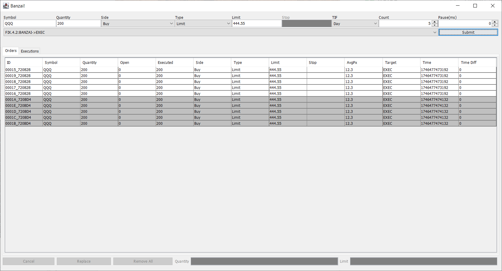
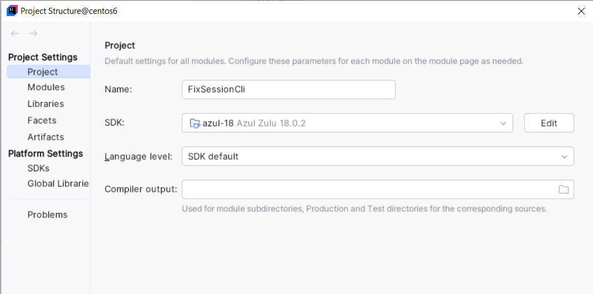

# FIX Session Tester

### Objective
FIX session testing is often overlooked. There is limited tooling for session tests.
This project is for beginners to understand how session management works. 
The project is written as an example for session test via CLI and is based on quickfixj's examples, i.e. banzai and executor


### Limitations
The project is based on quickfixj's FIX engine. Some session behaviors and management might be different from other FIX engines implementations.

### Changes

The Banzai ui has received a few updates. 
* Order pre-made - symbol, quatity, side, type, price, TIF are preset
* Order repeater - same order can be repeated multiple times using order cloning
* Order pauser - repeated orders are gaped on the interval that uses busy spin
* Blotter clean up - clear out entries in order blotter or execution blotter



### Basic Operation

#### CLI Connection
Banzai is the client, Executor is the server. Both listen on their respective CLI ports, 1798 and 1799. 
Linux NC command is used to interact with the engine.

    nc localhost 1798 
     
    rlwrap nc localhost 1798 

#### CLI Start and Stop

To start

    $ rlwrap nc localhost 1799
    welcome to cli, CTRL-C to quit cli
    -> FIX.4.2:EXEC->BANZAI has logged on
    -> FIX.4.3:EXEC->BANZAI has logged on
    -> FIXT.1.1:EXEC->BANZAI has logged on
    -> FIX.4.4:EXEC->BANZAI has logged on
    -> FIX.4.1:EXEC->BANZAI has logged on
    -> FIX.4.0:EXEC->BANZAI has logged on

To end

    quit
    -> exiting cli

### CLI Commands
#### Session Management

Session commands support session actions, i.e. logon, logout, disconnect, disconnectall, sequence number change and etc.

##### Session resend
Ask for resend from a sequence number

```declarative
session current
-> FIX.4.2:BANZAI->EXEC[in:11206,out:2355]
session resend 11170
-> 8=FIX.4.29=6935=234=235849=BANZAI52=20250504-19:59:05.23956=EXEC7=1117016=010=167 sent

20250504-19:59:02.536: 8=FIX.4.2☺9=56☺35=0☺34=2357☺49=BANZAI☺52=20250504-19:59:02.536☺56=EXEC☺10=089☺
20250504-19:59:05.239: 8=FIX.4.2☺9=69☺35=2☺34=2358☺49=BANZAI☺52=20250504-19:59:05.239☺56=EXEC☺7=11170☺16=0☺10=167☺
20250504-19:59:05.242: 8=FIX.4.2☺9=187☺35=8☺34=11170☺43=Y☺49=EXEC☺52=20250504-19:59:05.241☺56=BANZAI☺122=20250504-19:46:27☺6=12.3☺11=1746375632829☺14=200☺17=7240☺20=0☺31=12.3☺32=200☺37=7240☺38=200☺39=2☺54=1☺55=QQQ☺150=2☺151=0☺10=160☺
20250504-19:59:05.243: 8=FIX.4.2☺9=160☺35=8☺34=11171☺43=Y☺49=EXEC☺52=20250504-19:59:05.242☺56=BANZAI☺122=20250504-19:46:27☺6=0☺11=1746375632834☺14=0☺17=7241☺20=0☺37=7241☺39=0☺54=1☺55=QQQ☺150=2☺151=0☺10=201☺
20250504-19:59:05.243: 8=FIX.4.2☺9=187☺35=8☺34=11172☺43=Y☺49=EXEC☺52=20250504-19:59:05.242☺56=BANZAI☺122=20250504-19:46:27☺6=12.3☺11=1746375632834☺14=200☺17=7242☺20=0☺31=12.3☺32=200☺37=7242☺38=200☺39=2☺54=1☺55=QQQ☺150=2☺151=0☺10=163☺
20250504-19:59:05.243: 8=FIX.4.2☺9=160☺35=8☺34=11173☺43=Y☺49=EXEC☺52=20250504-19:59:05.243☺56=BANZAI☺122=20250504-19:46:27☺6=0☺11=1746375632839☺14=0☺17=7243☺20=0☺37=7243☺39=0☺54=1☺55=QQQ☺150=2☺151=0☺10=213☺
20250504-19:59:05.243: 8=FIX.4.2☺9=187☺35=8☺34=11174☺43=Y☺49=EXEC☺52=20250504-19:59:05.243☺56=BANZAI☺122=20250504-19:46:27☺6=12.3☺11=1746375632839☺14=200☺17=7244☺20=0☺31=12.3☺32=200☺37=7244☺38=200☺39=2☺54=1☺55=QQQ☺150=2☺151=0☺10=175☺
20250504-19:59:05.244: 8=FIX.4.2☺9=160☺35=8☺34=11175☺43=Y☺49=EXEC☺52=20250504-19:59:05.243☺56=BANZAI☺122=20250504-19:46:27☺6=0☺11=1746375632844☺14=0☺17=7245☺20=0☺37=7245☺39=0☺54=1☺55=QQQ☺150=2☺151=0☺10=215☺
20250504-19:59:05.244: 8=FIX.4.2☺9=187☺35=8☺34=11176☺43=Y☺49=EXEC☺52=20250504-19:59:05.244☺56=BANZAI☺122=20250504-19:46:27☺6=12.3☺11=1746375632844☺14=200☺17=7246☺20=0☺31=12.3☺32=200☺37=7246☺38=200☺39=2☺54=1☺55=QQQ☺150=2☺151=0☺10=178☺
20250504-19:59:05.244: 8=FIX.4.2☺9=160☺35=8☺34=11177☺43=Y☺49=EXEC☺52=20250504-19:59:05.244☺56=BANZAI☺122=20250504-19:46:27☺6=0☺11=1746375632849☺14=0☺17=7247☺20=0☺37=7247☺39=0☺54=1☺55=QQQ☺150=2☺151=0☺10=227☺
20250504-19:59:05.245: 8=FIX.4.2☺9=187☺35=8☺34=11178☺43=Y☺49=EXEC☺52=20250504-19:59:05.244☺56=BANZAI☺122=20250504-19:46:27☺6=12.3☺11=1746375632849☺14=200☺17=7248☺20=0☺31=12.3☺32=200☺37=7248☺38=200☺39=2☺54=1☺55=QQQ☺150=2☺151=0☺10=189☺
20250504-19:59:05.245: 8=FIX.4.2☺9=99☺35=4☺34=11179☺43=Y☺49=EXEC☺52=20250504-19:59:05.245☺56=BANZAI☺122=20250504-19:59:05☺36=11209☺123=Y☺10=168☺
20250504-19:59:35.823: 8=FIX.4.2☺9=57☺35=0☺34=11209☺49=EXEC☺52=20250504-19:59:35.822☺56=BANZAI☺10=138☺
```
##### Session testrequest
Send a test request with a unique identifier

```declarative
session testrequest
-> testrequest on 1746388910636 sent

20250504-20:01:37.540: 8=FIX.4.2☺9=56☺35=0☺34=2363☺49=BANZAI☺52=20250504-20:01:37.540☺56=EXEC☺10=068☺
20250504-20:01:50.636: 8=FIX.4.2☺9=74☺35=1☺34=2364☺49=BANZAI☺52=20250504-20:01:50.636☺56=EXEC☺112=1746388910636☺10=199☺
20250504-20:01:50.638: 8=FIX.4.2☺9=75☺35=0☺34=11214☺49=EXEC☺52=20250504-20:01:50.638☺56=BANZAI☺112=1746388910636☺10=243☺
```

##### Sequence number reset
Resets IN and OUT sequence to 1

```declarative
session current
-> FIX.4.2:BANZAI->EXEC[in:11231,out:2381]
session reset
-> FIX.4.2:BANZAI->EXEC has logged out
-> session was reset
-> FIX.4.2:BANZAI->EXEC has logged out
-> FIX.4.2:BANZAI->EXEC has logged out

20250504-20:10:22.176: 8=FIX.4.2☺9=56☺35=5☺34=2381☺49=BANZAI☺52=20250504-20:10:22.176☺56=EXEC☺10=072☺
20250504-20:10:22.730: 8=FIX.4.2☺9=65☺35=A☺34=1☺49=BANZAI☺52=20250504-20:10:22.730☺56=EXEC☺98=0☺108=30☺10=204☺
20250504-20:10:22.732: 8=FIX.4.2☺9=109☺35=5☺34=11232☺49=EXEC☺52=20250504-20:10:22.731☺56=BANZAI☺58=MsgSeqNum too low, expecting 2382 but received 1☺10=211☺
20250504-20:10:22.732: 8=FIX.4.2☺9=53☺35=5☺34=2☺49=BANZAI☺52=20250504-20:10:22.732☺56=EXEC☺10=167☺
20250504-20:10:27.741: 8=FIX.4.2☺9=65☺35=A☺34=3☺49=BANZAI☺52=20250504-20:10:27.741☺56=EXEC☺98=0☺108=30☺10=213☺
20250504-20:10:27.743: 8=FIX.4.2☺9=109☺35=5☺34=11233☺49=EXEC☺52=20250504-20:10:27.743☺56=BANZAI☺58=MsgSeqNum too low, expecting 2382 but received 3☺10=222☺
20250504-20:10:27.827: 8=FIX.4.2☺9=53☺35=5☺34=4☺49=BANZAI☺52=20250504-20:10:27.827☺56=EXEC☺10=179☺

session current
-> FIX.4.2:BANZAI->EXEC[in:20,out:40]
-> FIX.4.2:BANZAI->EXEC has logged out
```

##### Session sequence number change
Change IN or OUT sequence number to a given value

```declarative
session current
-> FIX.4.2:BANZAI->EXEC[in:45,out:90]
-> FIX.4.2:BANZAI->EXEC has logged out
-> FIX.4.2:BANZAI->EXEC has logged out
-> FIX.4.2:BANZAI->EXEC has logged out
session sender 2382
-> sender seq# set to 2382
-> FIX.4.2:BANZAI->EXEC has logged on

20250504-20:14:37.740: 8=FIX.4.2☺9=67☺35=A☺34=100☺49=BANZAI☺52=20250504-20:14:37.740☺56=EXEC☺98=0☺108=30☺10=057☺
20250504-20:14:37.741: 8=FIX.4.2☺9=111☺35=5☺34=11282☺49=EXEC☺52=20250504-20:14:37.741☺56=BANZAI☺58=MsgSeqNum too low, expecting 2382 but received 100☺10=060☺
20250504-20:14:37.742: 8=FIX.4.2☺9=55☺35=5☺34=101☺49=BANZAI☺52=20250504-20:14:37.742☺56=EXEC☺10=020☺
20250504-20:14:42.735: 8=FIX.4.2☺9=68☺35=A☺34=2382☺49=BANZAI☺52=20250504-20:14:42.735☺56=EXEC☺98=0☺108=30☺10=120☺
20250504-20:14:42.737: 8=FIX.4.2☺9=69☺35=A☺34=11283☺49=EXEC☺52=20250504-20:14:42.737☺56=BANZAI☺98=0☺108=30☺10=171☺
20250504-20:14:42.737: 8=FIX.4.2☺9=68☺35=2☺34=2383☺49=BANZAI☺52=20250504-20:14:42.737☺56=EXEC☺7=2385☺16=0☺10=111☺
20250504-20:14:42.811: 8=FIX.4.2☺9=97☺35=4☺34=2385☺43=Y☺49=EXEC☺52=20250504-20:14:42.810☺56=BANZAI☺122=20250504-20:14:42☺36=7555☺123=Y☺10=044☺
20250504-20:14:42.811: 8=FIX.4.2☺9=159☺35=8☺34=7555☺43=Y☺49=EXEC☺52=20250504-20:14:42.810☺56=BANZAI☺122=20250504-19:46:23☺6=0☺11=1746374412551☺14=0☺17=3625☺20=0☺37=3625☺39=0☺54=1☺55=QQQ☺150=2☺151=0☺10=148☺
20250504-20:14:42.811: 8=FIX.4.2☺9=186☺35=8☺34=7556☺43=Y☺49=EXEC☺52=20250504-20:14:42.811☺56=BANZAI☺122=20250504-19:46:23☺6=12.3☺11=1746374412551☺14=200☺17=3626☺20=0☺31=12.3☺32=200☺37=3626☺38=200☺39=2☺54=1☺55=QQQ☺150=2☺151=0☺10=102☺
```
##### Session log on and out

When a session is logged out or disconnected by the CLI, the session is put on the blocked list for reconnections. 

```declarative
session list
-> FIXT.1.1:BANZAI->EXEC[in:186,out:186]
FIX.4.2:BANZAI->EXEC[in:3733,out:1920]
FIX.4.0:BANZAI->EXEC[in:186,out:186]
FIX.4.1:BANZAI->EXEC[in:186,out:186]
FIX.4.3:BANZAI->EXEC[in:206,out:197]
FIX.4.4:BANZAI->EXEC[in:186,out:187]

session FIX.4.2:BANZAI->EXEC
-> FIX.4.2:BANZAI->EXEC[in:3734,out:1921] is current

session disconnect
-> FIX.4.2:BANZAI->EXEC has logged out
-> session was disconnected

session connect
-> session was logged on
-> FIX.4.2:BANZAI->EXEC has logged on

session current
-> FIX.4.2:BANZAI->EXEC[in:3735,out:1922]

session logout
-> session was logout
-> FIX.4.2:BANZAI->EXEC has logged out
```

All sessions can be disconnected and connected via CLI. The disconnect on the acceptor throws RejectLogon 
when logon is attempted - hence the client session is disabled from reconnect.

```declarative
session FIX.4.2:EXEC->BANZAI
-> FIX.4.2:EXEC->BANZAI[in:1942,out:3755] is current

session current
-> FIX.4.2:EXEC->BANZAI[in:2165,out:3880]
session disconnect
-> FIX.4.2:EXEC->BANZAI has logged out
-> session was disconnected

20250504-19:36:32.733: No responder, not sending message: 8=FIX.4.2☺9=56☺35=5☺34=2166☺49=BANZAI☺52=20250504-19:36:32.733☺56=EXEC☺10=089☺
20250504-19:36:32.729: 8=FIX.4.2☺9=68☺35=A☺34=2165☺49=BANZAI☺52=20250504-19:36:32.729☺56=EXEC☺98=0☺108=30☺10=133☺
20250504-19:36:32.732: 8=FIX.4.2☺9=71☺35=5☺34=3880☺49=EXEC☺52=20250504-19:36:32.731☺56=BANZAI☺58=not allowed☺10=092☺
20250504-19:36:32.733: 8=FIX.4.2☺9=56☺35=5☺34=2166☺49=BANZAI☺52=20250504-19:36:32.733☺56=EXEC☺10=089☺
20250504-19:36:32.730: 8=FIX.4.2☺9=68☺35=A☺34=2165☺49=BANZAI☺52=20250504-19:36:32.729☺56=EXEC☺98=0☺108=30☺10=133☺
20250504-19:36:32.731: 8=FIX.4.2☺9=71☺35=5☺34=3880☺49=EXEC☺52=20250504-19:36:32.731☺56=BANZAI☺58=not allowed☺10=092☺
20250504-19:36:37.750: No responder, not sending message: 8=FIX.4.2☺9=56☺35=5☺34=2168☺49=BANZAI☺52=20250504-19:36:37.750☺56=EXEC☺10=095☺
20250504-19:36:37.745: 8=FIX.4.2☺9=68☺35=A☺34=2167☺49=BANZAI☺52=20250504-19:36:37.745☺56=EXEC☺98=0☺108=30☺10=138☺
20250504-19:36:37.748: 8=FIX.4.2☺9=71☺35=5☺34=3881☺49=EXEC☺52=20250504-19:36:37.747☺56=BANZAI☺58=not allowed☺10=105☺
20250504-19:36:37.750: 8=FIX.4.2☺9=56☺35=5☺34=2168☺49=BANZAI☺52=20250504-19:36:37.750☺56=EXEC☺10=095☺

session current
-> FIX.4.2:EXEC->BANZAI[in:2191,out:3906]
session connect
-> session was logged on
-> FIX.4.2:EXEC->BANZAI has logged on

20250504-19:38:54.737: MsgSeqNum too high, expecting 3906 but received 3908: 8=FIX.4.2☺9=68☺35=A☺34=3908☺49=EXEC☺52=20250504-19:38:54.736☺56=BANZAI☺98=0☺108=30☺10=143☺
20250504-19:38:54.737: Enqueued at pos 3908: 8=FIX.4.2☺9=68☺35=A☺34=3908☺49=EXEC☺52=20250504-19:38:54.736☺56=BANZAI☺98=0☺108=30☺10=143☺
20250504-19:38:54.735: 8=FIX.4.2☺9=68☺35=A☺34=2219☺49=BANZAI☺52=20250504-19:38:54.735☺56=EXEC☺98=0☺108=30☺10=136☺
20250504-19:38:54.737: 8=FIX.4.2☺9=68☺35=A☺34=3908☺49=EXEC☺52=20250504-19:38:54.736☺56=BANZAI☺98=0☺108=30☺10=143☺
20250504-19:38:54.737: 8=FIX.4.2☺9=68☺35=2☺34=3909☺49=EXEC☺52=20250504-19:38:54.737☺56=BANZAI☺7=2193☺16=0☺10=130☺
20250504-19:38:54.737: 8=FIX.4.2☺9=68☺35=2☺34=2220☺49=BANZAI☺52=20250504-19:38:54.737☺56=EXEC☺7=3906☺16=0☺10=118☺
20250504-19:38:54.740: 8=FIX.4.2☺9=97☺35=4☺34=2193☺43=Y☺49=BANZAI☺52=20250504-19:38:54.740☺56=EXEC☺122=20250504-19:38:54☺36=2221☺123=Y☺10=062☺
20250504-19:38:54.741: 8=FIX.4.2☺9=97☺35=4☺34=3906☺43=Y☺49=EXEC☺52=20250504-19:38:54.740☺56=BANZAI☺122=20250504-19:38:54☺36=3910☺123=Y☺10=071☺
20250504-19:38:54.736: MsgSeqNum too high, expecting 2193 but received 2219: 8=FIX.4.2☺9=68☺35=A☺34=2219☺49=BANZAI☺52=20250504-19:38:54.735☺56=EXEC☺98=0☺108=30☺10=136☺
20250504-19:38:54.737: Enqueued at pos 2219: 8=FIX.4.2☺9=68☺35=A☺34=2219☺49=BANZAI☺52=20250504-19:38:54.735☺56=EXEC☺98=0☺108=30☺10=136☺
20250504-19:38:54.735: 8=FIX.4.2☺9=68☺35=A☺34=2219☺49=BANZAI☺52=20250504-19:38:54.735☺56=EXEC☺98=0☺108=30☺10=136☺
20250504-19:38:54.736: 8=FIX.4.2☺9=68☺35=A☺34=3908☺49=EXEC☺52=20250504-19:38:54.736☺56=BANZAI☺98=0☺108=30☺10=143☺
20250504-19:38:54.737: 8=FIX.4.2☺9=68☺35=2☺34=3909☺49=EXEC☺52=20250504-19:38:54.737☺56=BANZAI☺7=2193☺16=0☺10=130☺
20250504-19:38:54.738: 8=FIX.4.2☺9=68☺35=2☺34=2220☺49=BANZAI☺52=20250504-19:38:54.737☺56=EXEC☺7=3906☺16=0☺10=118☺
20250504-19:38:54.740: 8=FIX.4.2☺9=97☺35=4☺34=2193☺43=Y☺49=BANZAI☺52=20250504-19:38:54.740☺56=EXEC☺122=20250504-19:38:54☺36=2221☺123=Y☺10=062☺
20250504-19:38:54.740: 8=FIX.4.2☺9=97☺35=4☺34=3906☺43=Y☺49=EXEC☺52=20250504-19:38:54.740☺56=BANZAI☺122=20250504-19:38:54☺36=3910☺123=Y☺10=071☺
20250504-19:39:25.540: 8=FIX.4.2☺9=56☺35=0☺34=3910☺49=EXEC☺52=20250504-19:39:25.540☺56=BANZAI☺10=083☺
20250504-19:39:25.541: 8=FIX.4.2☺9=56☺35=0☺34=2221☺49=BANZAI☺52=20250504-19:39:25.541☺56=EXEC☺10=078☺
20250504-19:39:25.540: 8=FIX.4.2☺9=56☺35=0☺34=3910☺49=EXEC☺52=20250504-19:39:25.540☺56=BANZAI☺10=083☺
20250504-19:39:25.541: 8=FIX.4.2☺9=56☺35=0☺34=2221☺49=BANZAI☺52=20250504-19:39:25.541☺56=EXEC☺10=078☺
```


#### mutator

Mutator is very powerful to mutate incoming or/and outgoing messages. Message tags and header tags can be added, removed, changed and set empty. 

Supported tag operations are ADD, HADD, SET, HSET, REMOVE, HREMOVE, EMPTY, HEMPTY. The H prefix designates header tag operations.

Invalid tag values or missing tags have different handling on the counterparty sides. Some would reject, some would drop on the floor, some become DK.

Some rejections come from the FIX gateways, some rejections come from the backend processors. 

There has been recent CAT reporting requirements on rejected orders if not all, i.e. invalid tag values, missing tags and etc.

```declarative
mutate
-> not processed
mutate show
-> tag map is {}
mutate D SET 58 food
-> processing D SET 58 food
mutate 9 SET 58 foo
-> processing 9 SET 58 foo
mutate show
-> tag map is {D=[Tag{action=SET, tag=58, value='food'}], 9=[Tag{action=SET, tag=58, value='foo'}]}
mutate clear x
-> tag map does not have message type x
mutate clear 9
-> tag map cleared message type 9
mutate show
-> tag map is {D=[Tag{action=SET, tag=58, value='food'}]}
mutate clear
-> tag map cleared
```

Tag removal causes rejection on "Required tag missing"
```declarative
mutate D REMOVE 55
-> processing D REMOVE 55
20250509-21:44:49.890: 8=FIX.4.2^a9=138^a35=D^a34=181^a49=BANZAI^a52=20250509-21:44:49.889^a56=EXEC^a11=0000C_26637010418^a21=1^a38=200^a40=2^a44=444.55^a54=1^a59=0^a60=20250509-21:44:49.889^a10=007^a
20250509-21:44:49.891: 8=FIX.4.2^a9=105^a35=3^a34=205^a49=EXEC^a52=20250509-21:44:49.891^a56=BANZAI^a45=181^a58=Required tag missing^a371=55^a372=D^a373=1^a10=100^a
```

Empty tag value causes rejection on "Tag specified without a value"
```declarative
mutate D EMPTY 55
-> processing D EMPTY 55
20250509-21:46:56.573: 8=FIX.4.2^a9=142^a35=D^a34=186^a49=BANZAI^a52=20250509-21:46:56.572^a56=EXEC^a11=0000D_283B654544E^a21=1^a38=200^a40=2^a44=444.55^a54=1^a55=^a59=0^a60=20250509-21:46:56.572^a10=196^a
20250509-21:46:56.575: 8=FIX.4.2^a9=114^a35=3^a34=210^a49=EXEC^a52=20250509-21:46:56.574^a56=BANZAI^a45=186^a58=Tag specified without a value^a371=55^a372=D^a373=4^a10=137^a  
```

Quickfixj is a very popular open source project and has been adopted by many businesses. I have come to work on Quickfixj projects since 2007.

### Build and Run

#### IDE Config
##### Select JDK18 in Project structure


##### Select JDK18 in IDE settings


#### Java
JDK release 18 is required
```declarative
$ java -version
openjdk version "18.0.2.1" 2022-08-18
OpenJDK Runtime Environment Zulu18.32+13-CA (build 18.0.2.1+1)
OpenJDK 64-Bit Server VM Zulu18.32+13-CA (build 18.0.2.1+1, mixed mode, sharing)
```    

#### Run

```declarative
java -cp ./build/libs/FixSessionCli-1.0-SNAPSHOT-all.jar -Dlog4j2.debug -Dlogname=client.log fixsession.banzai.Banzai

java -cp ./build/libs/FixSessionCli-1.0-SNAPSHOT-all.jar -Dlog4j.debug -Dlog4j2.debug -Dlogname=server.log fixsession.executor.Executor
```
